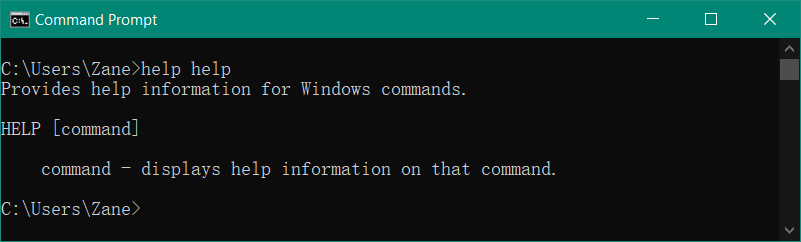
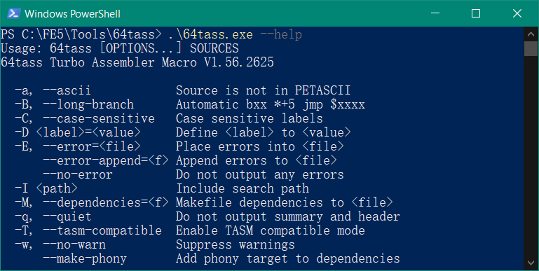
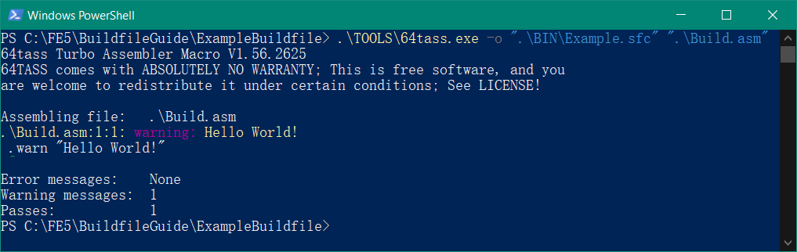

If you hang out around me or in FEU long enough, you'll eventually hear someone mention `buildfiles`. This guide will talk about what a buildfile is, tell you why they're neat, show you how to start/maintain one, and give you some tips and tricks based on my experiences.

### What is a "buildfile"?

`buildfile` refers to both the style of project management and development (called the `buildfile method`) and an individual file that is core to the buildfile method (called the `buildfile` or `build script`).

The `buildfile method` of hacking doesn't rely on a tool to edit the ROM directly. Instead, changes are written out into files to be used with a tool called an assembler. The main input for the assembler is the `buildfile`, which is the root of all files to be included, branching out like a tree. These component files consist of data, code, graphics, etc. They might include other files, too.

From now on, I'll use the word `buildfile` to mean the build script and all component files included by it and its components.

For many types of components, it's more natural to create and edit them in a format that the game cannot understand, like saving graphics as `.png`s or having tables be `.csv`s. These files must be processed into usable formats native before final assembly happens. Many of the files in your buildfile will be human-readable text files that instruct the assembler to do various tasks like moving where it's putting data, inserting data, inserting code, including other files, etc.

The other input for the assembler is the base ROM that we're modifying. Instead of overwriting this base ROM, we write our edits over a copy of it, so you don't have to fear your clean ROM getting edited. It's not recommended, but you can use a ROM that's already been modified by other tools instead of one that's unedited.

Whenever you want an output ROM (say, for testing or when you want to publish a release or whatever), you trigger the `build process`, which ensures that all components are built into their native formats before running the assembler with your buildfile and base ROM. This output ROM shouldn't be modified with other tools, as any changes made to it will be lost on later builds.

### What's the benefit of a buildfile?

A buildfile is a flexible, open-ended hacking method. This is a blessing as well as a curse. You are not bound by the limits of any one tool, save your assembler (although, the solution here is to look for a better assembler or make one.), but you are generally left to figure things out yourself.

By using version control software like [Git](https://git-scm.com/), it's easy to track, revert, and manage changes to your hack. If you make some kind of mistake that breaks your hack, you can use this software to help you compare your current progress to past versions and revert changes. When coupled with [GitHub](https://github.com/), you can have your progress backed-up online, complete with the same version history tracking that `git` affords. As an added benefit, `GitHub` lets you share the source of your hack with collaborators and releases with end users. With traditional editing tools like FEBuilderGBA, Emblem Magic, FEditor, etc. you'd likely be stuck passing around a ROM or patch to people working with you, manually noting changes (if you even bother doing that). The other alternative is that people funnel components to one person who does the actual insertion work, I guess.

A buildfile is (mostly) transparent in the changes it makes. Tools like FEditor apply changes to your ROM without telling you. Most tools leave it to you to keep accurate notes on changes you make, where you put things, and the order in which you do things. In addition to many parts of a buildfile being self-documenting, you have the option to embed your notes in many files as comments.

We'll get to this later in the tips and tricks section, but most tasks can be automated in ways that you couldn't accomplish using traditional tools. Instead of opening a tool and clicking the same set up buttons repeatedly to insert all of your portraits, for example, you'd set up some way to turn a human-editable portrait into native data and then your buildfile would handle putting all of the data for all of your portraits into the output. Again, we'll get to doing this later, for now just remember that the philosophy is `automate, don't repeat`.

### Setting up a buildfile

#### Prerequisites

You absolutely need a good programming-focused text editor. Something made for writing documents like `Microsoft Word` is not worthless, and something as basic as `notepad` is usable but lacks a huge number of quality of life features. I recommend (Sublime Text)[https://www.sublimetext.com/], but Notepad++ and Microsoft Visual Studio are also decent choices.

Your choice of assembler has a huge impact on the structure of your buildfile and its capabilities.

For the GBA Fire Emblem games, people have repurposed [Nintenlord's `E`vent `A`ssembler](https://feuniverse.us/t/event-assembler/1749) from a tool designed to edit a game's event scripts into a general-purpose assembler. EA has decent usability for inserting data for GBA games, and has been used for other games apart from GBAFE like [The Minish Cap](https://github.com/minishmaker).

For the SNES Fire Emblem games, I recommend [64tass](https://sourceforge.net/projects/tass64/), and it's what I'll be using for the rest of this guide. Click the link and download it. If you're on Linux, you'll need to compile the executable, but hopefully I don't need to tell you how to do that if you're comfortable using Linux.

Generally, assemblers are [command-line](https://en.wikipedia.org/wiki/Command-line_interface) tools, meaning that the way you use them is by typing in a text command into a shell such as `PowerShell` or `Command Prompt` on Windows or (`ba`)`sh` on Linux. For people who are only used to graphical user interfaces, this might seem scary. Before we get into the thick of things, it'll be useful if you spend a little bit of time looking up the basic usage of whichever shell is appropriate for you.



This is Windows' Command Prompt. To open it, you can search for `cmd` in the start menu or open it in a folder by shift-right-clicking in the empty space around files (but not selecting them) in Windows Explorer to open a context menu that says `Open Command Prompt window here` (or `Open PowerShell window here` or similar). You can also type `cmd` into the address bar in Windows Explorer in a folder.

The first line,

```
C:\Users\Zane>help help
```

has two main parts: the part before the `>` (in this case, `C:\Users\Zane`), which is the file directory where the shell is currently running, and the command being run (`help help`). In this case, we're running a program called `help` with the parameter `help`. The following lines

```
Provides help information for Windows commands.

HELP [command]

    command - displays help information on that command.

```

are the output of the `help` program. Programs often print the status of what they're doing back to the shell. This can be in the form of diagnostics, errors, anything really. Many programs don't print anything. After finishing a task, the shell gives us our prompt (`C:\Users\Zane>`) again and waits for us to input another command and hit enter.

If you're ever unsure of how to use a command or program, try using one of these:
```
help <command>
<command> --help
<command> -h
```

where `<command>` is replaced with whatever you're trying to run. In the example, `<command>` was `help`

Being able to change the current folder that the shell is operating in is very useful. You can use the `cd` command to change the `c`urrent `d`irectory, like this:


The parameter for `cd` is the folder that you want to navigate to's path. As you can see, after running the command, the current folder (the part before the `>`) changed.

Anyway, fetch `64tass` and open your shell there/navigate the shell there using cd.



I've switched to PowerShell to mix things up a bit (You'll notice that PowerShell prepends `PS` before the current directory.). Here, I'm looking at 64tass' help message. The `.\` before the command (the program `64tass.exe` and the parameter `--help`) means that `64tass.exe` is in the current folder. `.` means `the current folder`, `..` means one folder up from where we're at, `..\..` mean two up, etc. If we did `cd ..` from this folder, we'd end up in `C:\FE5\Tools`.

#### Structure

Organization is important, and ultimately how you organize your buildfile is up to you. To demonstrate the basics, we're going to put together a starter project structure.

First, we start with a special folder that we call the `<root>` folder. This is the folder that contains the rest of our files. Generally, it's best to name this file after your project. For this example, we'll name it `ExampleBuildfile`. As a best practice, you should avoid any spaces or special characters in any folder or filenames for anything related or leading up to your project. That is to say, `C:\Users\Zane\My ~ Really ~ Cool ~ Hack!!!!\$donate@to@circles$\` is a very bad file path. Stick to alphanumeric characters and underscores.

In our `root` folder, we're going to put some subfolders named `BIN`, `SRC`, `TOOLS`, `GFX`, and `TABLES`. I like to have my project subfolders in all-caps because I think it makes them visually distinct from files. The `BIN` folder is where our output files are going to go: typically, this is the hack's ROM, but it'll also have other files generated by the assembler and emulators/debuggers. We have our own folder for this stuff so that it's easy to clean up. The `SRC` folder is where the bulk of our files will go. We'll group up things in here into subfolders for various tasks like installing portraits, class data, menus, etc. The `GFX` folder is for general graphics that are shared or standalone. Same thing for the `TABLES` folder, but for tables and data.

The `TOOLS` folder is where we'll put the tools that'll help us process our component files, along with our assembler. Go and put the `64tass` executable in here.

Now, we put our base ROM in our `<root>` folder. Since this guide is focused on FE5, this'll be a clean, unedited ROM version of Fire Emblem: Thracia 776 called `FE5.sfc`.

#### The build script

In our `<root>` folder, we'll create our main build script. We want it to be clearly-named. I'm going to go with `Build.asm`. The `.asm` extension here was chosen so that my text editor can highlight its contents nicely, but the actual choice of extension name doesn't matter. File extensions don't dictate the contents of a file, so just try to pick something and be consistent. For files that get are read by the assembler and put things into the ROM I'll be using `.asm`.

Anyway, in this file we'll just put a single line to make sure things are working:

```
.warn "Hello World!"
```

Now, we'll open our shell and navigate to our `<root>` folder and run `64tass` like so:

```
.\TOOLS\64tass.exe -o ".\BIN\Example.sfc" ".\Build.asm"
```

This will be slightly different depending on a few things. You should change `".\BIN\Example.sfc"` to whatever you want the output to be named. You should change `".\Build.asm"` to match your build script's name. On Linux, your backslashes will be forward slashes and the executable will probably not have an extension.



If everything worked, you should see something like this.

